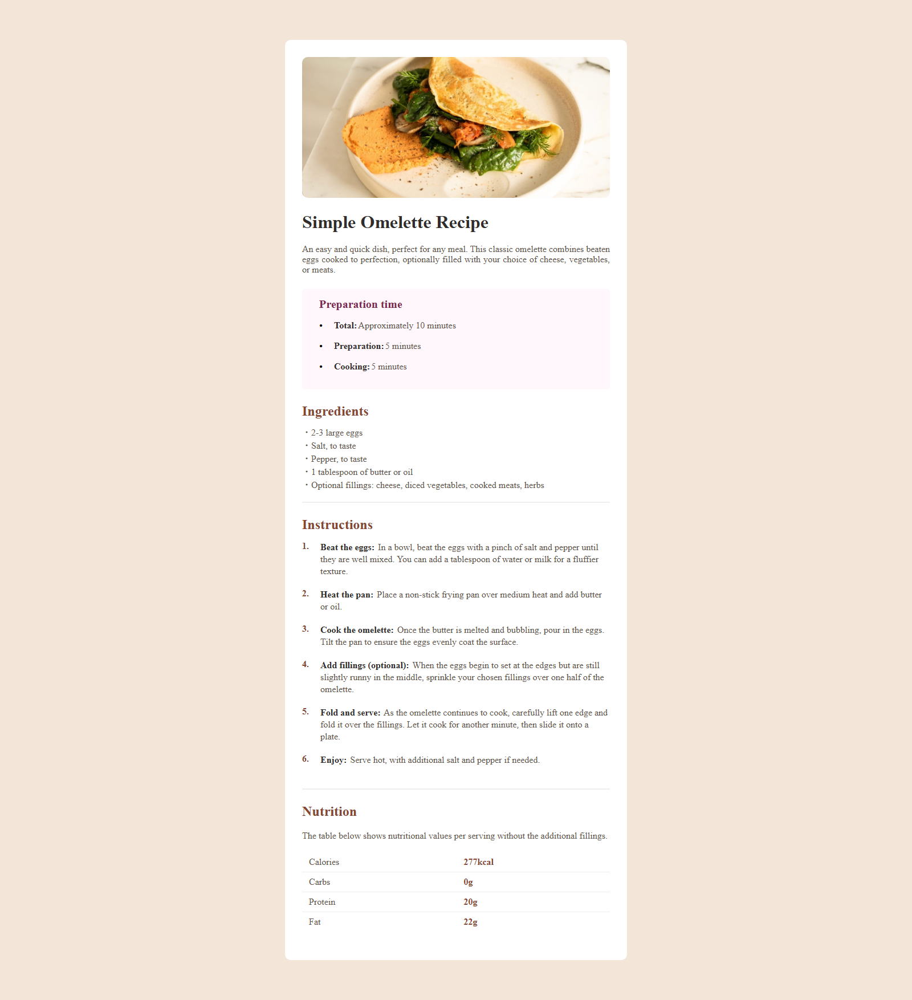

# Frontend Mentor - Recipe page
This is a solution to the [Recipe Page challenge on Frontend Mentor](https://www.frontendmentor.io/challenges/recipe-page-KiTsR8QQKm).  

Frontend Mentor challenges help improve your front-end skills by building realistic projects.

## Welcome! 👋

Thanks for checking out this front-end coding challenge.

####  :
 - 
 - 

      ---
 you can see my project in [this demo](https://zeynab-jalalian.github.io/Recipe-Page/)
  ___

